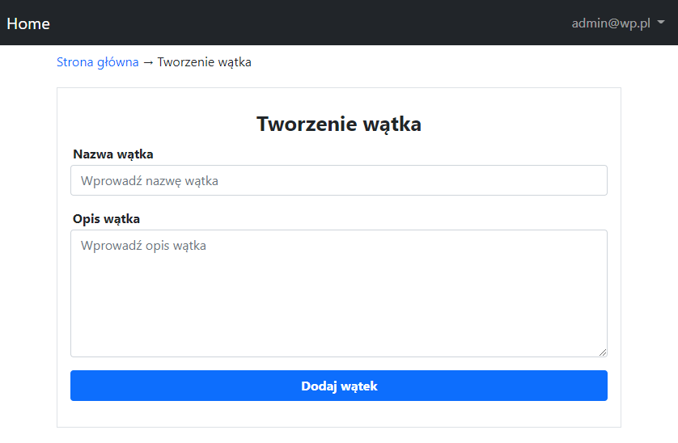

# Symfony Forum
It is a simple forum enabling creates threads for admin and topic, posts and comments for users.

## Build with
1. Symfony 5.4
2. PHP 7.4
3. Bootstrap 5

## Features
1. Management of threads for admin
2. Management of topics, posts and comments for users
3. Commands to generate content

## Installation Instructions
1. Run `git clone https://github.com/dawidbros1/symfony-forum.git`
2. Run `composer install`
3. Run `copy .env_dist .env` and configure connection to database
4. Run `php bin/console doctrine:database:create`
5. Run `php bin/console doctrine:schema:update --force`

## Table of contents
- [Screenshots](#screenshots)
- [Routes](#routes)
- [Commands](#commands)

## Screenshots
<kbd>

<!-- HomePage -->

<!-- Thread -->

<!-- Topic -->

<!-- Post -->

<!-- Comment -->

<!-- MyList -->

</kbd>

## Routes
| Method | URI | Action | Name |
| --- | --- | --- | --- |
| GET | / | src/Controller/HomepageController@index | app_homepage |
| GET\|POST | /thread/create| src/Controller/ThreadController@create | thread_create |
| GET\|POST | /thread/edit| src/Controller/ThreadController@edit | thread_edit |
| GET | /thread/delete| src/Controller/ThreadController@delete | thread_delete |
| GET\|POST | /thread/show/id| src/Controller/ThreadController@show | thread_show |
| GET\|POST | /topic/create| src/Controller/TopicController@create | topic_create |
| GET\|POST | /topic/edit| src/Controller/TopicController@edit | topic_edit |
| GET | /topic/delete| src/Controller/TopicController@delete | topic_delete |
| GET\|POST | /topic/show/id| src/Controller/TopicController@show | topic_show |
| GET | /topic/my_list| src/Controller/TopicController@listMyTopics | topic_my_list |
| GET\|POST | /post/create| src/Controller/PostController@create | post_create |
| GET\|POST | /post/edit| src/Controller/PostController@edit | post_edit |
| GET | /post/delete| src/Controller/PostController@delete | post_delete |
| GET | /post/my_list| src/Controller/PostController@listMyPosts | post_my_list |
| GET\|POST | /comment/create| src/Controller/CommentController@create | comment_create |
| GET\|POST | /comment/edit| src/Controller/CommentController@edit | comment_edit |
| GET | /comment/delete| src/Controller/CommentController@delete | comment_delete |
| GET | /comment/my_list| src/Controller/CommentController@listMyComments | comment_my_list |

## Commands
* `php bin/console db:seed:user`: The command deletes existing users and creates 2 new users(password: admin123).
* `php bin/console db:seed:thread`: The command deletes existing threads and generates new 4 threads
* `php bin/console db:seed:topic limit`: The command generates topics
* `php bin/console db:seed:post limit`: The command generates posts
* `php bin/console db:seed:comment limit`: The command generates comments
* `php bin/console db:table:clear name_of_entity`: The command remove content of table by entity name
* `php bin/console db:thread:create name description`: The command adds thread
* `php bin/console db:thread:remove name`: The command removes thread
